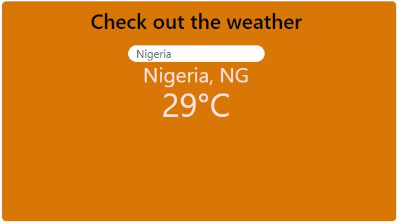
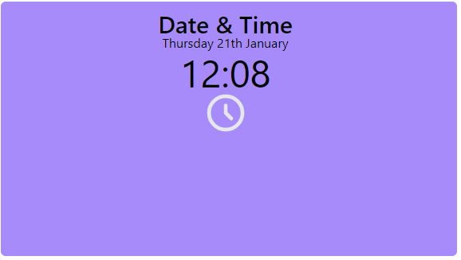
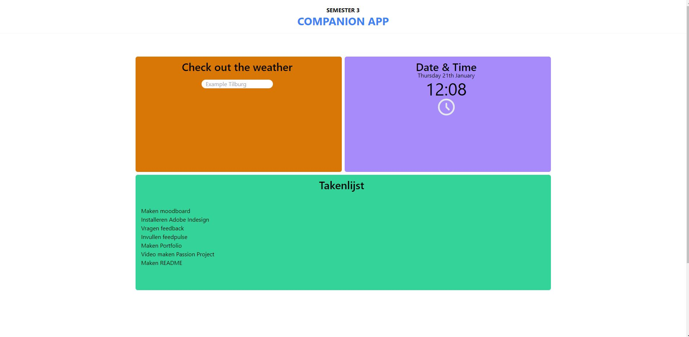
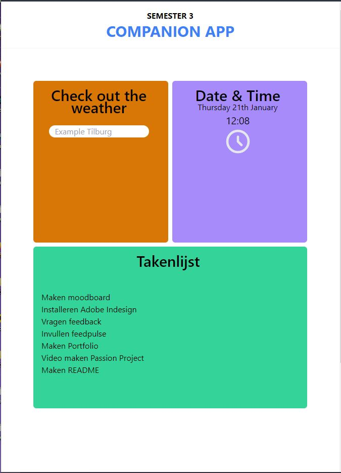

# Passion project

This project is built in [Create React App](https://reactjs.org/), [Tailwind CSS  ](https://tailwindcss.com/), , [Open Weather API ](https://openweathermap.org/current), And [Google Firebase](https://console.firebase.google.com/)

## About

This project is inspired by this [Design](https://xd.adobe.com/view/988da839-dd61-4b95-9fa8-c0159b130b61-cdde/) and gave it my own twist to it.

In this app you can Check out the weather , the time and date and the data received from the database.

Weather = Openweather API  
Time and date = Vanilla Javascript  
Read data (Takenlijst) = Google Firebase  
 
This database is connected to this repository [Repository](https://github.com/afthamafer/Google-Firebase-CRUD-Data) and makes it possible to use the CRUD elements.
All the changes will be applied to this project when that repository is used.

With Tailwind CSS i made the layout of the website. Tailwind CSS is a utility-first CSS framework for rapidly building custom user interfaces. Its responsive and is easy to use for a beginner like me.

# Preview

Open Weather API

 
 
Vanilla JS 

 
 
Tailwind CSS

